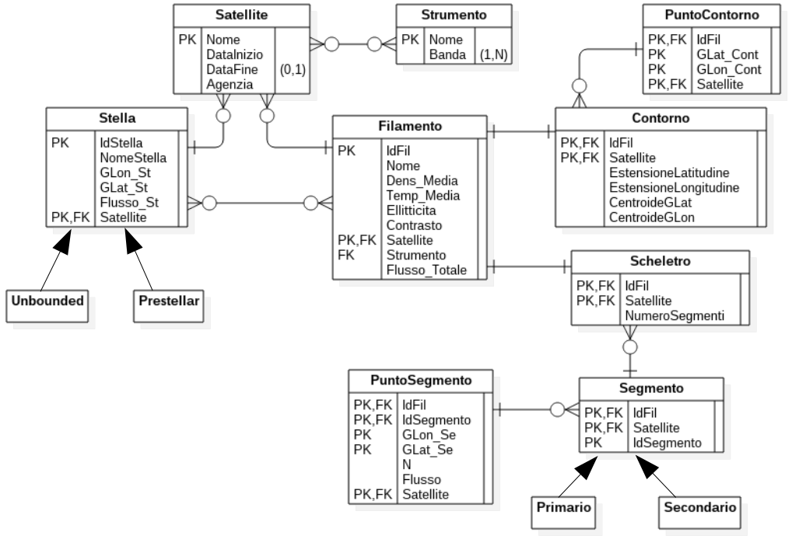
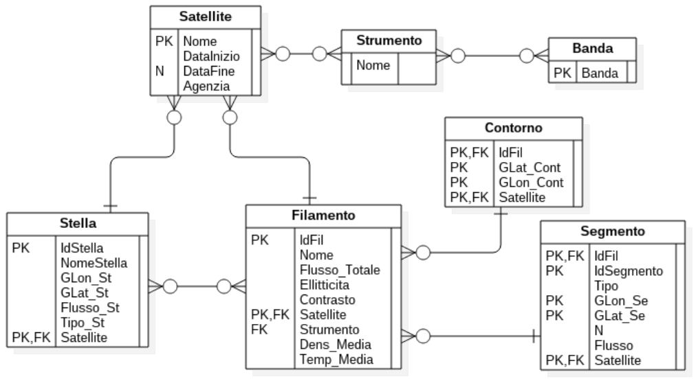

# DataBase
Repository for a DB class.

This repository contains a Java application. This application interacts with PostgreSQL, through JDBC, to retrive and inspect data. The application GUI is made with JavaFX. Both the Java application and the database are executed on the same node.

A first E-R diagram has been made.

Later, it has been refined into the following diagram. 

Tests have been made using JUnit.